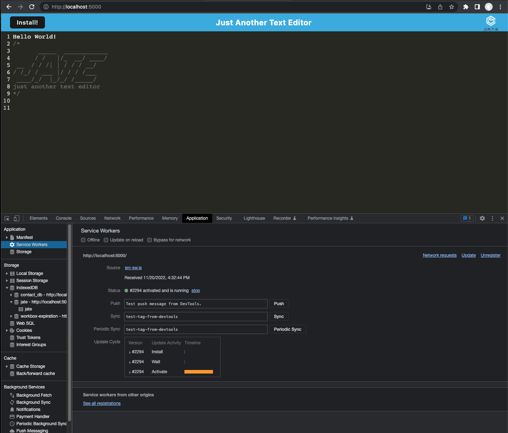
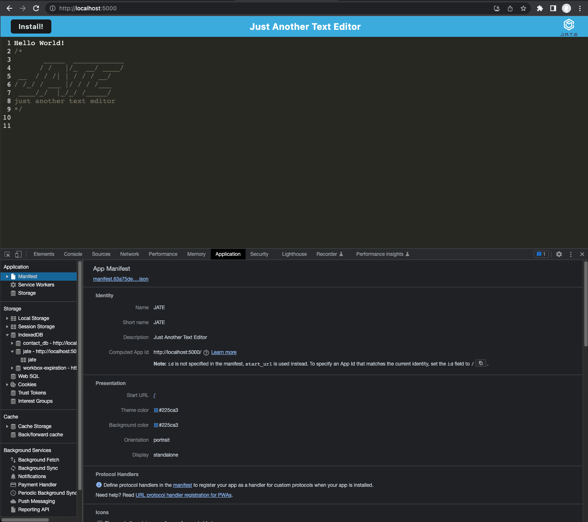
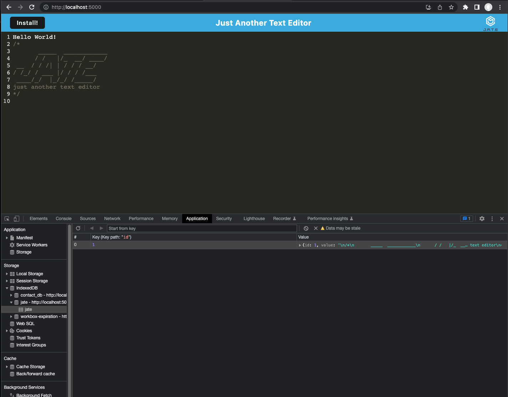

# text-editor-pwa

## Description

The application is a web text editor where user can create notes or code snippets with or without an internet connection and allow the user reliably retrieve them for later use. The integrated service worker and Cache API's ensure that the application will remain fully function with or without internet connection.

## Table of Contents

- [Description](#Description)
- [Installation](#Installation)
- [Usage](#Usage)
- [Tests](#tests)
- [Contributing](#Contributing)
- [Questions](#Questions)
- [License](#License)

## Installation

- To use this application, run the following command to install the dependencies:

      npm install

## Usage

The Text-Editor application is currently deployed with [Heroku](https://fathomless-mountain-60724.herokuapp.com/)

Run the following command at the root of your project.

1. type `npm start` to start server.
2. Open browser and enter the address `http://localhost:3000`

- Application installed to the local computer
  

- Service Worker active
  

- Loaded Manifest
  

- IndexedDB
  

## Contributing

1. Fork this repository
2. Create a new branch
3. Commit changes on your branch
4. Push your changes
5. Create a new pull request

## Questions

If you have any question or would like to report the issues in this project, please feel free to contact me at email_to_be_annouced@domain.com

## License

This project is license under the [MIT](./LICENSE)

&copy; 2022 Joseph Lara
